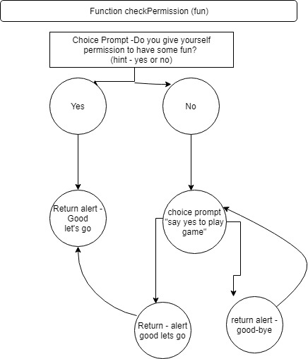

# JavaScript
Content during week 3 & 4 of Codeschool. Our task was to build a game using .js. \\
##Live Life Game
Game Overview.
1. The purpose of the game is for player to 'self-improve' throughout various levels, ultimately seeking to be "enlightened".
2. The game has six levels to complete. 
3. Each level, player is introduced to a new "character" they need to interact with to learn a lesson.
4. Player is presented with three choices in each level. 
4. Each choice has a repsonse being "definitely not and a reason why"; "a tongue-in-cheek response" and "the best response". 
5. By choosing the 'best response', player progresses to a new level.

#Process updates
1. Game starts with my first decision tree which ended up being shooting really high - eeek recursion!  First time using draw.io. \\
 \\
## The game is a text based that runs in alerts in .js.   
### The project was great fun and I leaned into my creative side to create a fun story for the user.  
## Looking back in week 10 at this game - I realise it was less about any real developer and programming skills as I just didn't have the skills at this stage to understand how powerful DOM Elements and JS events could be this stage!  But great fun and a game that works!
